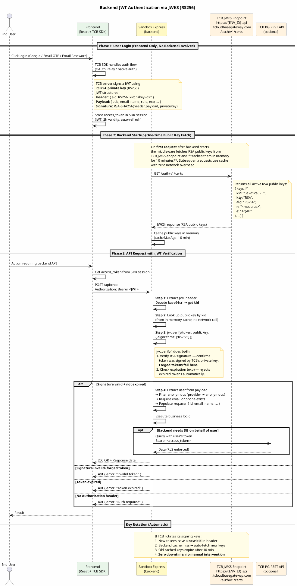
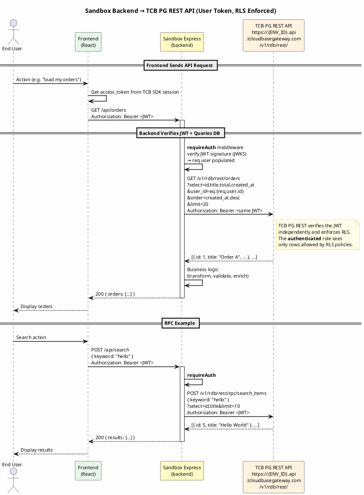

# Genie TCB Auth Integration (OAuth Relay + Email OTP + Email Password)

Implement user authentication for **web apps** using TCB with OAuth Relay proxy, native email verification code, and email password registration/login. User profile (email, name, avatar) is stored in TCB Auth user attributes — no database needed.

> **小程序项目请使用 `genie-tcb-auth-miniprogram-integrator` skill。**

## Scenarios

- **OAuth (Google)**: Social login via Genie OAuth Relay proxy → TCB custom login
- **Email OTP (Register)**: Email verification code signup via TCB native auth (frontend SDK)
- **Email OTP (Login)**: Email verification code login via TCB native auth (frontend SDK)
- **Email Password (Register)**: Email + password signup via TCB native auth (frontend SDK)
- **Email Password (Login)**: Email + password login via TCB native auth (frontend SDK)
- **Password Reset**: Reset password via email verification code
- **Protected Routes**: Frontend route guards with `useAuth`
- **Session Management**: Automatic token persistence via TCB JS SDK
- **User Profile**: Stored in TCB Auth user attributes, read via HTTP API on page refresh

**Not recommended for:**
- Projects that don't need user authentication
- Mini-program (小程序) projects — use `genie-tcb-auth-miniprogram-integrator` instead

## Prerequisites

**Required: Frontend React web app.**

- Frontend: React app (for AuthContext and TCB JS SDK)
- Backend: **Not required** — OAuth callback is handled by a TCB cloud function (`oauth-callback`), pre-deployed by Genie

**Important:** TCB environments are created and managed by the Genie platform. Users cannot directly access the TCB console. Required login modules (including email verification code login), cloud functions, and custom login keys are all pre-configured by Genie.

## MANDATORY: TCB Environment User Confirmation

**DO NOT run `ensure-cloudbase-env.sh` or any TCB setup without explicit user approval.**

Before ANY auth integration work, you MUST follow this exact sequence:

1. **Check** if `/workspace/.env.tcb` exists:
   ```bash
   cat /workspace/.env.tcb 2>/dev/null
   ```

2. **If `.env.tcb` exists** and contains `CLOUDBASE_ENV_ID`: TCB is ready, skip to Setup Step 1.

3. **If `.env.tcb` does NOT exist**: You MUST **STOP** and use `ask_followup_question` to ask the user:
   ```
   The project does not have a TCB (Tencent CloudBase) environment yet.
   This is required for authentication features (Google OAuth, email login).

   Would you like to enable TCB authentication for this project?
   ```
   Options:
   - **Enable TCB Auth** — Creates a TCB environment with Google OAuth and email login support
   - **Skip** — Do not enable TCB auth at this time

4. **ONLY if user explicitly selects "Enable TCB Auth"**, run:
   ```bash
   bash /workspace/.genie/scripts/bash/ensure-cloudbase-env.sh --project-dir /workspace
   ```

5. If user selects "Skip", do NOT create the environment. Inform the user that auth features require TCB and stop the auth setup.

**NEVER assume the user wants TCB enabled. NEVER skip the confirmation step. Even if the user says "add login" or "implement authentication", you MUST still ask for TCB environment confirmation first.**

If the script fails, report the error to the user. Do not retry automatically.

Verify after success: `cat /workspace/.env.tcb` should show `CLOUDBASE_ENV_ID`, `CLOUDBASE_REGION`, `CLOUDBASE_PUBLISH_KEY`.

## Setup

```bash
bash /workspace/.genie/scripts/bash/ensure-cloudbase-env.sh --project-dir /workspace
```

If the script fails, report the error to the user. Do not retry automatically.

Verify after success: `cat /workspace/.env.tcb` should show `CLOUDBASE_ENV_ID`, `CLOUDBASE_REGION`, `CLOUDBASE_PUBLISH_KEY`.

### 1. Verify SDK Installed

`ensure-cloudbase-env.sh` automatically installs `@cloudbase/js-sdk` in the frontend. Verify:

```bash
ls frontend/node_modules/@cloudbase/js-sdk/package.json
```

### 2. Copy SDK Files

Read the following files from this skill's `lib/` directory and copy them to the project:

| Source (this skill) | Target (project) | Used by | Key exports |
|---------------------|-------------------|---------|-------------|
| `lib/cloudbase-frontend.ts` | `frontend/src/lib/cloudbase.ts` | Frontend | `auth`, `db`, `getAccessToken()` |
| `lib/auth-context.tsx` | `frontend/src/lib/AuthContext.tsx` | Frontend | `useAuth()`, `AuthProvider` |
| `lib/auth-callback.tsx` | `frontend/src/pages/AuthCallback.tsx` | Frontend | OAuth callback page |

**Note:** No backend files needed. OAuth callback is handled by the `oauth-callback` TCB cloud function, pre-deployed by Genie.

### 3. Configure Vite Environment

The frontend needs TCB credentials exposed via Vite env vars. Add to `vite.config.ts`:

```typescript
import fs from 'fs'

// Inside defineConfig:
const tcbEnvPath = '/workspace/.env.tcb'
let tcbEnv: Record<string, string> = {}
if (fs.existsSync(tcbEnvPath)) {
  fs.readFileSync(tcbEnvPath, 'utf-8').split('\n').forEach(line => {
    const idx = line.indexOf('=')
    if (idx > 0) tcbEnv[line.slice(0, idx).trim()] = line.slice(idx + 1).trim()
  })
}

// Add to the returned config object:
define: {
  'import.meta.env.VITE_CLOUDBASE_ENV_ID': JSON.stringify(tcbEnv.CLOUDBASE_ENV_ID || ''),
  'import.meta.env.VITE_CLOUDBASE_REGION': JSON.stringify(tcbEnv.CLOUDBASE_REGION || 'ap-shanghai'),
  'import.meta.env.VITE_CLOUDBASE_PUBLISH_KEY': JSON.stringify(tcbEnv.CLOUDBASE_PUBLISH_KEY || ''),
}
```

### 4. Wrap App with AuthProvider and Route Guards

In `frontend/src/App.tsx`:

```typescript
import { AuthProvider, useAuth } from './lib/AuthContext'
import AuthCallback from './pages/AuthCallback'

function ProtectedRoute({ children }: { children: React.ReactNode }) {
  const { user, loading } = useAuth()
  if (loading) return <div>Loading...</div>
  if (!user) return <Navigate to="/" replace />
  return <>{children}</>
}

function GuestRoute({ children }: { children: React.ReactNode }) {
  const { user, loading } = useAuth()
  if (loading) return <div>Loading...</div>
  if (user) return <Navigate to="/dashboard" replace />
  return <>{children}</>
}

function App() {
  return (
    <BrowserRouter>
      <AuthProvider>
        <Routes>
          <Route path="/" element={<GuestRoute><LandingPage /></GuestRoute>} />
          <Route path="/dashboard" element={<ProtectedRoute><Dashboard /></ProtectedRoute>} />
          <Route path="/auth/callback" element={<AuthCallback />} />
        </Routes>
      </AuthProvider>
    </BrowserRouter>
  )
}
```

## Environment Variables Reference

| Variable | Location | Description |
|----------|----------|-------------|
| `CLOUDBASE_ENV_ID` | `.env.tcb` | TCB environment ID |
| `CLOUDBASE_REGION` | `.env.tcb` | TCB region (default: `ap-shanghai`) |
| `CLOUDBASE_PUBLISH_KEY` | `.env.tcb` | Publishable Key (frontend, limited permissions) |

**Note:** Server API Key and Custom Login Key are not needed in the sandbox. They are managed by the Genie platform and injected into the TCB cloud function environment.

## Architecture Overview

```
Frontend (React + TCB JS SDK)             TCB Cloud Function (oauth-callback)
├── OAuth → redirect to relay proxy       ├── Exchange code via OAuth Relay
├── Email OTP → TCB native auth           ├── createTicket(uid) with RSA key
├── callFunction('oauth-callback')        ├── POST /auth/v1/signin/custom
├── AuthContext (user state)              ├── Write user profile
├── auth.setSession() for TCB session     └── Return tokens + user info
├── auth.getUser() for user profile
└── Route guards (ProtectedRoute)
```

### Key Principles

1. **TCB JS SDK v2 ONLY**: This skill uses `@cloudbase/js-sdk` v2 API exclusively. The v1 API (`getVerification`, `signInWithEmail`, `verify`, old `signUp`) is **deprecated and no longer maintained**. Do NOT use v1 methods. All auth calls must use v2 methods: `signInWithOtp`, `signUp` (with `verifyOtp` callback), `signInWithPassword`, `resetPasswordForEmail`.
2. **OAuth**: Goes through the Genie OAuth Relay proxy. The `oauth-callback` TCB cloud function exchanges the auth code for user info, creates a TCB custom login ticket, and signs in via TCB Auth HTTP API. Frontend calls it via `callFunction('oauth-callback', { code, provider })`.
3. **Email OTP**: Uses TCB v2 `auth.signInWithOtp({ email })` — unified flow that auto-registers new users and logs in existing users. Returns `verifyOtp` callback for code verification.
4. **Email + Password**: Uses `auth.signInWithPassword({ email, password })`. Users set password via `auth.resetPasswordForEmail(email)` flow.
5. **User Profile**: Stored in TCB Auth user attributes. Written by cloud function after OAuth signin, read by frontend on page refresh. **No database or localStorage needed.**
6. **Session**: TCB JS SDK manages `access_token` and `refresh_token` in browser storage. Use `getAccessToken()` from `cloudbase.ts` to get the current token — this correctly handles the nested `data.session.access_token` path. **Do NOT use `auth.getSession().data.access_token`** (wrong path, will always be empty).
7. **iframe Support**: Detects iframe and uses popup + postMessage instead of redirect.
8. **No backend needed**: All server-side OAuth logic runs in a pre-deployed TCB cloud function. The sandbox only needs frontend code.

## OAuth Relay Flow

```
1. Frontend detects iframe vs normal mode:
   - Normal: window.location.href redirect
   - Iframe: window.open() popup with ?mode=popup

   GET {OAUTH_RELAY_URL}/authorize
     ?provider=google
     &callback_url={origin}/auth/callback[?mode=popup]

2. User authorizes on Google

3. Relay redirects back:
   {origin}/auth/callback?code=AUTH_CODE&provider=google[&mode=popup]

4. Callback page calls cloud function (automatic):
   callFunction('oauth-callback', { code, provider })
   Returns { access_token, refresh_token, user }

5. Frontend establishes session:
   - Normal: auth.setSession() + navigate('/dashboard')
   - Popup: postMessage to parent, parent calls setSession()
```

**Note:** Steps 4-5 are handled automatically by the `AuthCallback` component. Developers only need to call `signInWithGoogle()` from `useAuth()`.

## Quick Start

### Google OAuth Login

```typescript
// Frontend: trigger login
const { signInWithGoogle } = useAuth()
await signInWithGoogle()

// After login, user info is available:
const { user } = useAuth()
console.log(user?.email, user?.name, user?.avatar_url)
```

### Email OTP Register (New User)

```typescript
import { useState } from 'react'
import { useAuth } from '../lib/AuthContext'

const { sendEmailCode, signUpWithEmail } = useAuth()

// Step 1: Send verification code
const verificationInfo = await sendEmailCode('user@example.com')

// Step 2: User enters 6-digit code, then register
await signUpWithEmail('user@example.com', '123456', verificationInfo)
```

### Email OTP Login (Existing User)

```typescript
const { sendEmailCode, signInWithEmail } = useAuth()

// Step 1: Send verification code
const verificationInfo = await sendEmailCode('user@example.com')

// Step 2: User enters 6-digit code, then login
await signInWithEmail('user@example.com', '123456', verificationInfo)
```

### Email + Password Login

```typescript
const { signInWithEmailPassword } = useAuth()

// User must have set a password first (via reset password flow)
await signInWithEmailPassword('user@example.com', 'myPassword123')
```

### Reset Password (Forgot Password)

```typescript
const { resetPasswordForEmail } = useAuth()

// Step 1: Send reset code to email
const resetData = await resetPasswordForEmail('user@example.com')

// Step 2: User enters verification code + new password
const { data, error } = await resetData.updateUser({
  nonce: '123456',        // verification code from email
  password: 'newPassword' // new password
})
// User is auto-logged in after successful reset
```

### Change Password (Logged In)

```typescript
const { resetPasswordForOld } = useAuth()

await resetPasswordForOld('oldPassword123', 'newPassword456')
```

### Sign Out

```typescript
const { signOut } = useAuth()
await signOut()
```

### Access User in Dashboard

```typescript
import { useAuth } from '../lib/AuthContext'

export default function Dashboard() {
  const { user, signOut } = useAuth()
  return (
    <div>
      
      <h2>{user?.name}</h2>
      <p>{user?.email}</p>
      <button onClick={signOut}>Sign Out</button>
    </div>
  )
}
```

## Getting Access Token for API Calls

When calling backend APIs or external services that need the user's JWT:

```typescript
import { getAccessToken } from '../lib/cloudbase'

// In a React component or service function
const token = await getAccessToken()
if (!token) {
  // User not logged in — redirect or show login prompt
  return
}

// Use in fetch calls
const resp = await fetch('/api/orders', {
  headers: { 'Authorization': `Bearer ${token}` },
})
```

**IMPORTANT — `getSession()` data structure:**

CloudBase JS SDK v2 `auth.getSession()` returns a **nested** structure:

```typescript
const { data, error } = await auth.getSession()
// data = {
//   session: {             // ← token is nested here
//     access_token: "eyJ...",
//     refresh_token: "xxx",
//     user: { ... }
//   },
//   user: { ... }
// }

// ✅ CORRECT: data.session.access_token
const token = data?.session?.access_token

// ❌ WRONG: data.access_token — always undefined!
```

**Always use `getAccessToken()` from `cloudbase.ts`** — it handles the correct path and filters out anonymous sessions.

## Auth Methods Reference

| Method | Frontend Code | Backend Needed? |
|--------|---------------|----------------|
| Google OAuth | `signInWithGoogle()` | No (cloud function) |
| Email Send Code | `sendEmailCode(email)` | No |
| Email OTP Register | `signUpWithEmail(email, code, info)` | No |
| Email OTP Login | `signInWithEmail(email, code, info)` | No |
| Email + Password Login | `signInWithEmailPassword(email, password)` | No |
| Reset Password (forgot) | `resetPasswordForEmail(email)` | No |
| Change Password (logged in) | `resetPasswordForOld(oldPwd, newPwd)` | No |
| Sign Out | `signOut()` | No |
| Get User | `useAuth().user` | No |
| Get Access Token | `getAccessToken()` | No |

## Troubleshooting

### OAuth Callback Fails

**Possible causes:**
- OAuth code already used (codes are single-use)
- OAuth Relay service is down
- Cloud function environment variables not configured

**Solution:** Check TCB console cloud function logs for `oauth-callback`.

### OAuth Callback Returns Error

**Possible causes:**
- Cloud function `CUSTOM_LOGIN_KEY_ID` or `CUSTOM_LOGIN_PRIVATE_KEY` env vars not set
- TCB Auth API unreachable
- `createTicket()` failed

**Solution:** Check TCB console cloud function configuration for environment variables.

### User Profile Empty After Login

**Possible causes:**
- Cloud function failed to write user profile (non-fatal, check cloud function logs)
- User session expired

**Solution:** Check TCB console cloud function logs. Try logging in again.

### Page Refresh Shows Login Page

**Possible causes:**
- TCB session expired (access_token no longer valid)
- `auth.getSession()` returning accessKey scope instead of user scope
- Token is always empty string — **wrong data path**. The correct path is `data.session.access_token`, NOT `data.access_token`. Use `getAccessToken()` from `cloudbase.ts` instead of manually parsing.

**Solution:** User needs to log in again. The frontend checks `scope !== 'accessKey'` to distinguish user tokens from accessKey tokens.

## Security Best Practices

1. **Custom Login Key stays in cloud function** — injected as environment variables by Genie, never exposed to frontend or sandbox
2. **OAuth codes are single-use** — the relay exchange endpoint only accepts each code once
3. **Session tokens auto-refresh** — TCB JS SDK handles token refresh via `refresh_token`
4. **Sign out clears session** — `auth.signOut()` removes tokens from browser storage

## Sandbox Backend API Authentication (Optional)

**When to use**: Only when the user's generated web app has a **sandbox backend service** (Express running in Cloud Studio sandbox) that exposes API endpoints and needs to verify the caller's identity. The backend verifies JWT signatures using RSA public keys from TCB's JWKS endpoint — no Server API Key needed.

**When NOT needed**: Standard CRUD via `app.rdb()` — the frontend calls TCB PG REST API directly with the user's access_token, RLS enforces security at the database level, no sandbox backend involved. **This is the primary path for most apps.**

### Architecture



**Key security properties:**
- **RSA asymmetric crypto**: TCB signs with private key (secret), backend verifies with public key (freely available). Knowing the public key does NOT allow forging tokens.
- **Per-request verification**: Every API call is cryptographically verified. No database query, no remote API call (after initial key fetch).
- **Automatic key rotation**: JWKS cache expires every 10 min. If TCB rotates keys, backend picks up new keys automatically.

### Setup

1. Install required dependencies:

```bash
cd backend && pnpm add jsonwebtoken jwks-rsa && pnpm add -D @types/jsonwebtoken
```

2. Copy `lib/auth-middleware.ts` to your backend:

| Source (skill lib/) | Destination (project) | Environment |
|--------------------|-----------------------|-------------|
| `lib/auth-middleware.ts` | `backend/src/middleware/auth-middleware.ts` | Backend |

3. `CLOUDBASE_ENV_ID` — **no extra configuration needed**. The middleware auto-loads it with this priority:
   1. `process.env.CLOUDBASE_ENV_ID` — if the backend already loads `.env.tcb` via dotenv (the Genie backend template does this by default in `backend/src/config/env.ts`)
   2. **Fallback**: reads `/workspace/.env.tcb` directly at startup — this is the absolute path in all Genie sandboxes, so it always works as long as `ensure-cloudbase-env.sh` has been run

   This is the same approach as the frontend: Vite reads `/workspace/.env.tcb` at build time via `define`. The backend reads it at startup time via the fallback. Both use the same source file, same absolute path.

   > If both fail (e.g., `ensure-cloudbase-env.sh` was never run), the middleware logs `[auth-middleware] CLOUDBASE_ENV_ID not set` and rejects all tokens with 401.

4. Use in Express routes:

```typescript
import { requireAuth, optionalAuth, tcbFetchAsUser } from './middleware/auth-middleware'

// Protected route — requires login
app.post('/api/orders', requireAuth, async (req, res) => {
  const userId = req.user!.id
  const email = req.user!.email
  // ... business logic
})

// Optional auth — works for both logged-in and anonymous users
app.get('/api/items', optionalAuth, async (req, res) => {
  if (req.user) {
    // Authenticated user — show personalized content
  } else {
    // Anonymous — show public content
  }
})

// Forward user's token to TCB PG REST API (RLS enforced as user)
app.get('/api/my-items', requireAuth, async (req, res) => {
  const items = await tcbFetchAsUser(req, '/v1/rdb/rest/items?select=*&order=created_at.desc&limit=20')
  res.json(items)
})
```

### How it works (JWKS + RS256 signature verification)

1. **Frontend** logs in → gets `access_token` (JWT signed with RS256) from TCB Auth
2. **Frontend** sends API request with `Authorization: Bearer <access_token>`
3. **Backend middleware** decodes JWT header to get `kid` (key ID)
4. **Backend** fetches RSA public key from TCB JWKS endpoint (`/auth/v1/certs`) matching the `kid` — cached in memory for 10 minutes after first call
5. **Backend** calls `jwt.verify(token, publicKey, { algorithms: ['RS256'] })` to verify signature and expiration
6. **Middleware** extracts user info from verified payload, filters anonymous sessions
7. **Business logic** runs with verified `req.user`

Key points:
- **Cryptographic verification** — JWT signature is verified using RSA public key, forged tokens are rejected
- **No Server API Key needed** — public keys are freely available from JWKS endpoint
- **No remote API call per request** — public keys are cached in memory, subsequent verifications are local and instant
- **Key rotation safe** — if TCB rotates keys, cache expires in 10 min and new keys are fetched automatically
- **RLS still enforced** — if backend queries TCB PG REST API with user's token, database-level security applies
- **2-hour token validity** — frontend SDK auto-refreshes tokens transparently

### Exports from auth-middleware.ts

| Export | Type | Description |
|--------|------|-------------|
| `requireAuth` | Middleware | Returns 401 if no valid token. Sets `req.user`. |
| `optionalAuth` | Middleware | Sets `req.user` if token present, continues regardless. |
| `tcbFetchAsUser` | Function | Low-level: forward user's token to any TCB API endpoint. |
| `tcbQuery` | Function | SELECT rows from a table with filters, sort, pagination. |
| `tcbInsert` | Function | INSERT rows (single, batch, upsert). |
| `tcbUpdate` | Function | UPDATE rows matching filter. |
| `tcbDelete` | Function | DELETE rows matching filter. |
| `tcbRpc` | Function | Call a PostgreSQL function via RPC. |

### req.user fields

| Field | Type | Description |
|-------|------|-------------|
| `id` | string | TCB user UID |
| `email` | string | User email |
| `phone` | string | User phone |
| `name` | string | Display name (from user_metadata) |
| `avatar_url` | string | Avatar URL (from user_metadata) |
| `provider` | string | Auth provider (email, google, etc.) |
| `role` | string | TCB role (authenticated) |
| `is_anonymous` | boolean | Always false (anonymous filtered out) |

## Backend Database Access (PG REST + RPC)

When the sandbox backend needs to access the database on behalf of the authenticated user, use the typed PG REST helpers from `auth-middleware.ts`. All queries carry the user's JWT — RLS policies are enforced at the database level, same as the frontend SDK.

> **Prerequisites**: `requireAuth` middleware must run before these helpers (it verifies the JWT and populates `req.user`).

### Architecture



**Why route through the backend instead of calling PG REST directly from the frontend?**
- Business logic that can't run on the frontend (multi-step workflows, external API calls, validation)
- Aggregating multiple DB queries into a single API response
- Rate limiting, caching, or access control beyond what RLS provides
- Calling RPC functions that involve sensitive parameters

### Quick Start

```typescript
import { requireAuth, tcbQuery, tcbInsert, tcbRpc } from './middleware/auth-middleware'

// Query with filters + pagination
app.get('/api/orders', requireAuth, async (req, res) => {
  const { data, count } = await tcbQuery(req, 'orders', {
    select: 'id,title,total,status,created_at',
    filter: { user_id: `eq.${req.user!.id}`, status: 'neq.deleted' },
    order: 'created_at.desc',
    limit: 20,
    offset: 0,
    count: true,
  })
  res.json({ orders: data, total: count })
})

// Insert a row
app.post('/api/orders', requireAuth, async (req, res) => {
  const [order] = await tcbInsert(req, 'orders', {
    user_id: req.user!.id,
    title: req.body.title,
    status: 'pending',
  }, { returning: true })
  res.json({ order })
})

// Call an RPC function
app.post('/api/search', requireAuth, async (req, res) => {
  const results = await tcbRpc(req, 'search_items', {
    keyword: req.body.keyword,
  }, { select: 'id,title', order: 'created_at.desc', limit: 10 })
  res.json({ results })
})
```

### API Reference

All functions require `requireAuth` middleware to have run first (they read `req.headers.authorization`).

#### tcbQuery — SELECT

```typescript
tcbQuery<T>(req, table, options?) → Promise<{ data: T[], count?: number }>
```

| Option | Type | Description |
|--------|------|-------------|
| `select` | string | Columns: `'id,title,created_at'` or `'*'` |
| `filter` | Record\<string, string\> | PostgREST filters: `{ status: 'eq.published', price: 'gt.100' }` |
| `order` | string | Sort: `'created_at.desc'` or `'name.asc,id.desc'` |
| `limit` | number | Max rows |
| `offset` | number | Skip rows (for pagination) |
| `count` | boolean | Return total count (parsed from `Content-Range` header) |

Filter operators: `eq`, `neq`, `gt`, `gte`, `lt`, `lte`, `like`, `ilike`, `is`, `in`, `not`, `or`, `cs` (contains), `cd` (contained by), `ov` (overlaps)

#### tcbInsert — INSERT

```typescript
tcbInsert<T>(req, table, data, options?) → Promise<T[]>
```

| Option | Type | Description |
|--------|------|-------------|
| `returning` | boolean | Return inserted rows (`Prefer: return=representation`) |
| `upsert` | `'merge'` \| `'ignore'` | `merge` = ON CONFLICT DO UPDATE, `ignore` = DO NOTHING |

`data` can be a single object or an array for batch insert.

#### tcbUpdate — UPDATE

```typescript
tcbUpdate<T>(req, table, data, filter, options?) → Promise<T[]>
```

`filter` is **mandatory** — PG REST returns 400 without a WHERE condition.

```typescript
await tcbUpdate(req, 'orders', { status: 'shipped' }, { id: 'eq.123' }, { returning: true })
```

#### tcbDelete — DELETE

```typescript
tcbDelete<T>(req, table, filter, options?) → Promise<T[]>
```

`filter` is **mandatory** — PG REST returns 400 without a WHERE condition.

```typescript
await tcbDelete(req, 'orders', { id: 'eq.123' })
```

#### tcbRpc — RPC (Function Call)

```typescript
tcbRpc<T>(req, functionName, params?, queryOptions?) → Promise<T>
```

| Param | Type | Description |
|-------|------|-------------|
| `functionName` | string | PostgreSQL function name |
| `params` | Record\<string, any\> | Function arguments (sent as JSON body) |
| `queryOptions.select` | string | Column filter on result set |
| `queryOptions.order` | string | Sort result set |
| `queryOptions.limit` | number | Limit result rows |
| `queryOptions.offset` | number | Skip rows |

```typescript
// Simple RPC
const stats = await tcbRpc(req, 'get_dashboard_stats')

// RPC with params + result filtering
const top5 = await tcbRpc(req, 'search_items', { keyword: 'hello' }, {
  select: 'id,title,score',
  order: 'score.desc',
  limit: 5,
})
```

#### tcbFetchAsUser — Low-Level

```typescript
tcbFetchAsUser(req, path, options?) → Promise<any>
```

Use for non-standard PG REST operations or other TCB API endpoints. The typed helpers above are preferred for standard CRUD/RPC.

```typescript
// Custom Prefer header
const data = await tcbFetchAsUser(req, '/v1/rdb/rest/items?id=eq.1', {
  method: 'PATCH',
  body: { title: 'Updated' },
  headers: { 'Prefer': 'return=representation, count=exact' },
})
```

### Error Handling

All helpers throw on non-2xx responses. Wrap in try/catch:

```typescript
app.post('/api/orders', requireAuth, async (req, res) => {
  try {
    const [order] = await tcbInsert(req, 'orders', {
      user_id: req.user!.id,
      title: req.body.title,
    }, { returning: true })
    res.json({ order })
  } catch (err) {
    // err.message = "TCB API error 409: {...unique constraint...}"
    // err.message = "TCB API error 403: {...RLS policy denied...}"
    const status = err instanceof Error && err.message.includes('403') ? 403 : 500
    res.status(status).json({ error: err instanceof Error ? err.message : 'Database error' })
  }
})
```

### Three Data Access Paths (Summary)

| Path | Who calls | Auth | RLS | Use case |
|------|-----------|------|-----|----------|
| **Frontend SDK** `app.rdb()` | Frontend JS | User access_token via SDK | Yes | Standard CRUD — **primary path** |
| **Frontend RPC** `rpc()` helper | Frontend JS | User access_token via HTTP | Yes | Call PostgreSQL functions (SDK has no `db.rpc()` in v3) |
| **Backend helpers** `tcbQuery/tcbRpc` | Sandbox Express | User token forwarded | Yes | Business logic, aggregation, external APIs |
| **LLM scripts** `tcb-pg-query.sh` | LLM agent | auth-proxy (admin) | No | DDL, migrations, debug — **dev only** |

> **Note:** Frontend RPC uses the `rpc()` helper from `database.ts` (see `genie-tcb-db-integrator` skill), which calls `POST /v1/rdb/rest/rpc/{fn}` directly via HTTP. `@cloudbase/js-sdk@3.x` does NOT have `db.rpc()`.

## Resources

- **SDK Files**: `lib/cloudbase-frontend.ts`, `lib/auth-context.tsx`, `lib/auth-callback.tsx`
- **Backend Auth**: `lib/auth-middleware.ts` (optional, only for apps with backend APIs)
- **Cloud Function**: `oauth-callback` (pre-deployed by Genie, handles OAuth code exchange + custom login)
- **Environment Script**: `/workspace/.genie/scripts/bash/ensure-cloudbase-env.sh` (shared, auto-deployed)
